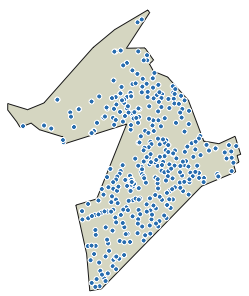

#### Background

Retrieve vector boundaries from [ONS](https://www.ons.gov.uk/)' [Open Geography Portal](http://geoportal.statistics.gov.uk/) using the `get_vector()` R function.

*Requirements*: [sf](https://cran.r-project.org/web/packages/sf/index.html) and [httr](https://cran.r-project.org/web/packages/httr/index.html) R packages.


```r
# load the get_vector() function
source("https://www.trafforddatalab.io/assets/rfunctions/boundaries/get_vector.R")
```

There are three arguments in the `get_vector()` function:

- **boundary** - provide the [URL for the vector boundary file](https://ons-inspire.esriuk.com/arcgis/rest/services). For example, the 2018 vector boundaries for electoral wards is `Administrative_Boundaries/Wards_May_2018_Boundaries `
- **condition** - provide a [where clause](https://developers.arcgis.com/rest/services-reference/query-feature-service-layer-.htm) to filter the attributes of the dataset
- **resolution** - indicate 1 of up to 4 possible resolutions: 0 = Full resolution (clipped); 1 = Full resolution (extent); 2 = Generalised (clipped) and; 3 = Ultra generalised (clipped). The default is 0.

---

#### Examples

##### Vector boundary of Trafford local authority

```r
bdy <- get_vector("Administrative_Boundaries/Local_Authority_Districts_DEC_2018_Boundaries", "lad18nm LIKE 'Trafford'", resolution = 3)
plot(st_geometry(bdy), col = "#DDDDCC", border = "#212121")
text(bdy$lon, y = bdy$lat, bdy$lad18nm, cex = 0.8, col = "#212121")
```


##### Vector boundaries of Clifford and Longford wards

```r
bdy <- get_vector("Administrative_Boundaries/Wards_May_2018_Boundaries", "wd18cd LIKE 'E05000825' OR wd18cd LIKE 'E05000832'", resolution = 2)
plot(st_geometry(bdy), col = "#DDDDCC", border = "#212121")
text(bdy$lon, y = bdy$lat, bdy$wd18nm, cex = 0.8, col = "#212121")
```


##### Latest postcode centroids for Clifford ward

```r
bdy <- get_vector("Administrative_Boundaries/Wards_May_2018_Boundaries", "wd18cd LIKE 'E05000825'", resolution = 2)
postcodes <- get_vector("Postcodes/ONS_Postcode_Directory_Latest_Centroids", "osward LIKE 'E05000825'")
plot(st_geometry(bdy), col = "#DDDDCC", border = "#212121")
plot(st_geometry(postcodes), add = T, pch = 21, cex = 0.7, bg = "#fc6721", col = "#FFFFFF")
```


